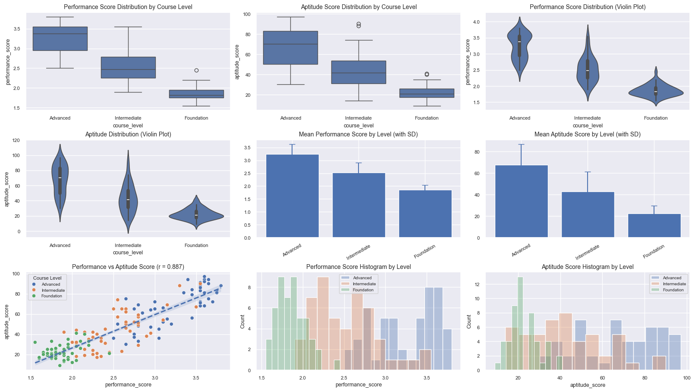

# Student Performance and Aptitude Analysis

## The Key English Course Company - Indonesia

## A Comprehensive Data-Driven Study


**Analysis Date:** January 13, 2026
**Total Students:** 150 (50 per course level)
**Variables Analyzed:** Performance Scores, Aptitude Scores
**Statistical Methods:** ANOVA, Correlation, Effect Sizes, Post-Hoc Tests
    

## Chapter 1: Environment Setup


```python
import pandas as pd
import numpy as np
import matplotlib.pyplot as plt
import seaborn as sns
from scipy.stats import f_oneway, shapiro, levene
import statsmodels.api as sm
from statsmodels.formula.api import ols
from statsmodels.stats.multicomp import pairwise_tukeyhsd
from scipy.stats import pearsonr

# Plotting setup
sns.set(style="darkgrid")
try:
    get_ipython().run_line_magic('matplotlib', 'inline')
except:
    plt.ion() # Fallback if not in IPython
```

## Chapter 2: Data Loading and Overview


```python
# Load Datasets
df_apt = pd.read_csv('data/student_aptitude_data.csv')
df_perf = pd.read_csv('data/student_performance_data.csv')
df = pd.read_csv('data/student_combined_data.csv')

# Ensure order
order = ["Advanced", "Intermediate", "Foundation"]
df["course_level"] = pd.Categorical(df["course_level"], categories=order, ordered=True)

print("Combined Data Shape:", df.shape)
display(df.head())
print("\nData Info:")
df.info()
```

    Combined Data Shape: (150, 4)
    


<div>
<style scoped>
    .dataframe tbody tr th:only-of-type {
        vertical-align: middle;
    }

    .dataframe tbody tr th {
        vertical-align: top;
    }

    .dataframe thead th {
        text-align: right;
    }
</style>
<table border="1" class="dataframe">
  <thead>
    <tr style="text-align: right;">
      <th></th>
      <th>student_id</th>
      <th>course_level</th>
      <th>performance_score</th>
      <th>aptitude_score</th>
    </tr>
  </thead>
  <tbody>
    <tr>
      <th>0</th>
      <td>1</td>
      <td>Advanced</td>
      <td>3.70</td>
      <td>72</td>
    </tr>
    <tr>
      <th>1</th>
      <td>2</td>
      <td>Advanced</td>
      <td>3.65</td>
      <td>90</td>
    </tr>
    <tr>
      <th>2</th>
      <td>3</td>
      <td>Advanced</td>
      <td>3.55</td>
      <td>68</td>
    </tr>
    <tr>
      <th>3</th>
      <td>4</td>
      <td>Advanced</td>
      <td>3.45</td>
      <td>84</td>
    </tr>
    <tr>
      <th>4</th>
      <td>5</td>
      <td>Advanced</td>
      <td>3.55</td>
      <td>72</td>
    </tr>
  </tbody>
</table>
</div>


    
    Data Info:
    <class 'pandas.core.frame.DataFrame'>
    RangeIndex: 150 entries, 0 to 149
    Data columns (total 4 columns):
     #   Column             Non-Null Count  Dtype   
    ---  ------             --------------  -----   
     0   student_id         150 non-null    int64   
     1   course_level       150 non-null    category
     2   performance_score  150 non-null    float64 
     3   aptitude_score     150 non-null    int64   
    dtypes: category(1), float64(1), int64(2)
    memory usage: 3.9 KB
    

## Chapter 3: Descriptive Statistics by Course Level


```python
print("--- Descriptive Statistics for All Columns ---")
display(df.describe())

print("\n--- Performance Score Stats by Course Level ---")
perf_stats = df.groupby("course_level", observed=False)["performance_score"].describe()
display(perf_stats)

print("\n--- Aptitude Score Stats by Course Level ---")
apt_stats = df.groupby("course_level", observed=False)["aptitude_score"].describe()
display(apt_stats)
```

    --- Descriptive Statistics for All Columns ---
    


<div>
<style scoped>
    .dataframe tbody tr th:only-of-type {
        vertical-align: middle;
    }

    .dataframe tbody tr th {
        vertical-align: top;
    }

    .dataframe thead th {
        text-align: right;
    }
</style>
<table border="1" class="dataframe">
  <thead>
    <tr style="text-align: right;">
      <th></th>
      <th>student_id</th>
      <th>performance_score</th>
      <th>aptitude_score</th>
    </tr>
  </thead>
  <tbody>
    <tr>
      <th>count</th>
      <td>150.000000</td>
      <td>150.000000</td>
      <td>150.000000</td>
    </tr>
    <tr>
      <th>mean</th>
      <td>75.500000</td>
      <td>2.540667</td>
      <td>44.240000</td>
    </tr>
    <tr>
      <th>std</th>
      <td>43.445368</td>
      <td>0.652830</td>
      <td>24.228133</td>
    </tr>
    <tr>
      <th>min</th>
      <td>1.000000</td>
      <td>1.550000</td>
      <td>9.000000</td>
    </tr>
    <tr>
      <th>25%</th>
      <td>38.250000</td>
      <td>1.950000</td>
      <td>22.000000</td>
    </tr>
    <tr>
      <th>50%</th>
      <td>75.500000</td>
      <td>2.475000</td>
      <td>38.000000</td>
    </tr>
    <tr>
      <th>75%</th>
      <td>112.750000</td>
      <td>3.037500</td>
      <td>65.000000</td>
    </tr>
    <tr>
      <th>max</th>
      <td>150.000000</td>
      <td>3.800000</td>
      <td>97.000000</td>
    </tr>
  </tbody>
</table>
</div>


    
    --- Performance Score Stats by Course Level ---
    


<div>
<style scoped>
    .dataframe tbody tr th:only-of-type {
        vertical-align: middle;
    }

    .dataframe tbody tr th {
        vertical-align: top;
    }

    .dataframe thead th {
        text-align: right;
    }
</style>
<table border="1" class="dataframe">
  <thead>
    <tr style="text-align: right;">
      <th></th>
      <th>count</th>
      <th>mean</th>
      <th>std</th>
      <th>min</th>
      <th>25%</th>
      <th>50%</th>
      <th>75%</th>
      <th>max</th>
    </tr>
    <tr>
      <th>course_level</th>
      <th></th>
      <th></th>
      <th></th>
      <th></th>
      <th></th>
      <th></th>
      <th></th>
      <th></th>
    </tr>
  </thead>
  <tbody>
    <tr>
      <th>Advanced</th>
      <td>50.0</td>
      <td>3.239</td>
      <td>0.384029</td>
      <td>2.50</td>
      <td>2.95</td>
      <td>3.375</td>
      <td>3.5500</td>
      <td>3.80</td>
    </tr>
    <tr>
      <th>Intermediate</th>
      <td>50.0</td>
      <td>2.518</td>
      <td>0.391460</td>
      <td>1.90</td>
      <td>2.25</td>
      <td>2.475</td>
      <td>2.7875</td>
      <td>3.55</td>
    </tr>
    <tr>
      <th>Foundation</th>
      <td>50.0</td>
      <td>1.865</td>
      <td>0.176777</td>
      <td>1.55</td>
      <td>1.75</td>
      <td>1.825</td>
      <td>1.9500</td>
      <td>2.45</td>
    </tr>
  </tbody>
</table>
</div>


    
    --- Aptitude Score Stats by Course Level ---
    


<div>
<style scoped>
    .dataframe tbody tr th:only-of-type {
        vertical-align: middle;
    }

    .dataframe tbody tr th {
        vertical-align: top;
    }

    .dataframe thead th {
        text-align: right;
    }
</style>
<table border="1" class="dataframe">
  <thead>
    <tr style="text-align: right;">
      <th></th>
      <th>count</th>
      <th>mean</th>
      <th>std</th>
      <th>min</th>
      <th>25%</th>
      <th>50%</th>
      <th>75%</th>
      <th>max</th>
    </tr>
    <tr>
      <th>course_level</th>
      <th></th>
      <th></th>
      <th></th>
      <th></th>
      <th></th>
      <th></th>
      <th></th>
      <th></th>
    </tr>
  </thead>
  <tbody>
    <tr>
      <th>Advanced</th>
      <td>50.0</td>
      <td>67.46</td>
      <td>19.171844</td>
      <td>30.0</td>
      <td>50.00</td>
      <td>70.0</td>
      <td>83.0</td>
      <td>97.0</td>
    </tr>
    <tr>
      <th>Intermediate</th>
      <td>50.0</td>
      <td>42.74</td>
      <td>18.279921</td>
      <td>14.0</td>
      <td>31.00</td>
      <td>41.5</td>
      <td>53.5</td>
      <td>90.0</td>
    </tr>
    <tr>
      <th>Foundation</th>
      <td>50.0</td>
      <td>22.52</td>
      <td>7.028339</td>
      <td>9.0</td>
      <td>17.25</td>
      <td>21.0</td>
      <td>26.0</td>
      <td>41.0</td>
    </tr>
  </tbody>
</table>
</div>


## Chapter 4: Statistical Assumption Testing

Checking assumptions for ANOVA: Normality (Shapiro-Wilk) and Homogeneity of Variances (Levene's Test).


```python
# Normality Test (Shapiro-Wilk)
print("--- Shapiro-Wilk Test for Normality (Performance Score) ---")
for level in order:
    subset = df[df["course_level"] == level]["performance_score"]
    stat, p = shapiro(subset)
    print(f"{level}: W={stat:.3f}, p={p:.3f}")

# Homogeneity of Variance (Levene's Test)
adv = df[df["course_level"] == "Advanced"]["performance_score"]
intm = df[df["course_level"] == "Intermediate"]["performance_score"]
found = df[df["course_level"] == "Foundation"]["performance_score"]

stat, p = levene(adv, intm, found)
print(f"\nLevene's Test (Performance): W={stat:.3f}, p={p:.3f}")
```

    --- Shapiro-Wilk Test for Normality (Performance Score) ---
    Advanced: W=0.909, p=0.001
    Intermediate: W=0.955, p=0.053
    Foundation: W=0.949, p=0.031
    
    Levene's Test (Performance): W=16.599, p=0.000
    

## Chapter 5: One-Way ANOVA Analysis


```python
# ANOVA for Performance Score
f_stat, p_val = f_oneway(adv, intm, found)
print("One-Way ANOVA (Performance Score):")
print(f"F-Statistic: {f_stat:.2f}")
print(f"P-Value: {p_val:.3e}")
if p_val < 0.05:
    print("Result: Significant difference found.")
else:
    print("Result: No significant difference.")

print()

# ANOVA for Aptitude Score
adv_apt = df[df["course_level"] == "Advanced"]["aptitude_score"]
intm_apt = df[df["course_level"] == "Intermediate"]["aptitude_score"]
found_apt = df[df["course_level"] == "Foundation"]["aptitude_score"]

f_stat_apt, p_val_apt = f_oneway(adv_apt, intm_apt, found_apt)
print("One-Way ANOVA (Aptitude Score):")
print(f"F-Statistic: {f_stat_apt:.2f}")
print(f"P-Value: {p_val_apt:.3e}")
```

    One-Way ANOVA (Performance Score):
    F-Statistic: 213.43
    P-Value: 3.352e-44
    Result: Significant difference found.
    
    One-Way ANOVA (Aptitude Score):
    F-Statistic: 101.17
    P-Value: 2.342e-28
    

## Chapter 6: Post-Hoc Tests (Tukey HSD)


```python
print("--- Tukey HSD Post-Hoc Test (Performance Score) ---")
tukey_perf = pairwise_tukeyhsd(endog=df['performance_score'], groups=df['course_level'], alpha=0.05)
print(tukey_perf)

print("\n--- Tukey HSD Post-Hoc Test (Aptitude Score) ---")
tukey_apt = pairwise_tukeyhsd(endog=df['aptitude_score'], groups=df['course_level'], alpha=0.05)
print(tukey_apt)
```

    --- Tukey HSD Post-Hoc Test (Performance Score) ---
    

         Multiple Comparison of Means - Tukey HSD, FWER=0.05     
    =============================================================
      group1      group2    meandiff p-adj  lower   upper  reject
    -------------------------------------------------------------
      Advanced   Foundation   -1.374   0.0 -1.5315 -1.2165   True
      Advanced Intermediate   -0.721   0.0 -0.8785 -0.5635   True
    Foundation Intermediate    0.653   0.0  0.4955  0.8105   True
    -------------------------------------------------------------
    
    --- Tukey HSD Post-Hoc Test (Aptitude Score) ---
    

          Multiple Comparison of Means - Tukey HSD, FWER=0.05      
    ===============================================================
      group1      group2    meandiff p-adj  lower    upper   reject
    ---------------------------------------------------------------
      Advanced   Foundation   -44.94   0.0 -52.4329 -37.4471   True
      Advanced Intermediate   -24.72   0.0 -32.2129 -17.2271   True
    Foundation Intermediate    20.22   0.0  12.7271  27.7129   True
    ---------------------------------------------------------------
    

## Chapter 7: Correlation Analysis


```python
corr_matrix = df[['performance_score', 'aptitude_score']].corr()
print("Correlation Matrix:")
display(corr_matrix)

r = df['performance_score'].corr(df['aptitude_score'])
print(f"\nPearson Correlation r: {r:.3f}")
```

    Correlation Matrix:
    


<div>
<style scoped>
    .dataframe tbody tr th:only-of-type {
        vertical-align: middle;
    }

    .dataframe tbody tr th {
        vertical-align: top;
    }

    .dataframe thead th {
        text-align: right;
    }
</style>
<table border="1" class="dataframe">
  <thead>
    <tr style="text-align: right;">
      <th></th>
      <th>performance_score</th>
      <th>aptitude_score</th>
    </tr>
  </thead>
  <tbody>
    <tr>
      <th>performance_score</th>
      <td>1.000000</td>
      <td>0.887417</td>
    </tr>
    <tr>
      <th>aptitude_score</th>
      <td>0.887417</td>
      <td>1.000000</td>
    </tr>
  </tbody>
</table>
</div>


    
    Pearson Correlation r: 0.887
    

## Chapter 8: Effect Sizes (Cohen's d)


```python
def cohens_d(x, y):
    nx, ny = len(x), len(y)
    pooled_std = np.sqrt(
        ((nx - 1)*x.var(ddof=1) + (ny - 1)*y.var(ddof=1)) / (nx + ny - 2)
    )
    return (x.mean() - y.mean()) / pooled_std

print("--- Cohen's d (Performance Score) ---")
print("Adv vs Intm:", cohens_d(adv, intm))
print("Intm vs Found:", cohens_d(intm, found))
print("Adv vs Found:", cohens_d(adv, found))

print("\n--- Cohen's d (Aptitude Score) ---")
print("Adv vs Intm:", cohens_d(adv_apt, intm_apt))
print("Intm vs Found:", cohens_d(intm_apt, found_apt))
print("Adv vs Found:", cohens_d(adv_apt, found_apt))
```

    --- Cohen's d (Performance Score) ---
    Adv vs Intm: 1.8593859641347326
    Intm vs Found: 2.150011598870396
    Adv vs Found: 4.596261595451747
    
    --- Cohen's d (Aptitude Score) ---
    Adv vs Intm: 1.319723811268185
    Intm vs Found: 1.4601027618025881
    Adv vs Found: 3.112449809627936
    

## Chapter 9: Comprehensive Visualizations


```python
# Visualizations from 04_visual_comparison.py
import numpy as np
import pandas as pd
import matplotlib.pyplot as plt
import seaborn as sns

def main():
    df = pd.read_csv("data/student_combined_data.csv")

    sns.set(style="darkgrid")
    order = ["Advanced", "Intermediate", "Foundation"]

    df["course_level"] = pd.Categorical(df["course_level"], categories=order, ordered=True)

    perf_stats = df.groupby("course_level", observed=False)["performance_score"].agg(["mean", "std"]).reindex(order)
    apt_stats  = df.groupby("course_level", observed=False)["aptitude_score"].agg(["mean", "std"]).reindex(order)

    r = df["performance_score"].corr(df["aptitude_score"])

    fig, axes = plt.subplots(3, 3, figsize=(16, 9), constrained_layout=True)

    sns.boxplot(data=df, x="course_level", y="performance_score", order=order, ax=axes[0,0])
    axes[0,0].set_title("Performance Score Distribution by Course Level")

    sns.boxplot(data=df, x="course_level", y="aptitude_score", order=order, ax=axes[0,1])
    axes[0,1].set_title("Aptitude Score Distribution by Course Level")

    sns.violinplot(data=df, x="course_level", y="performance_score", order=order, inner="box", ax=axes[0,2])
    axes[0,2].set_title("Performance Score Distribution (Violin Plot)")

    sns.violinplot(data=df, x="course_level", y="aptitude_score", order=order, inner="box", ax=axes[1,0])
    axes[1,0].set_title("Aptitude Distribution (Violin Plot)")

    axes[1,1].bar(order, perf_stats["mean"].values)
    axes[1,1].errorbar(order, perf_stats["mean"].values, yerr=perf_stats["std"].values, fmt="none", capsize=5)
    axes[1,1].set_title("Mean Performance Score by Level (with SD)")
    axes[1,1].tick_params(axis="x", rotation=30)

    axes[1,2].bar(order, apt_stats["mean"].values)
    axes[1,2].errorbar(order, apt_stats["mean"].values, yerr=apt_stats["std"].values, fmt="none", capsize=5)
    axes[1,2].set_title("Mean Aptitude Score by Level (with SD)")
    axes[1,2].tick_params(axis="x", rotation=30)

    sns.scatterplot(data=df, x="performance_score", y="aptitude_score", hue="course_level", hue_order=order, ax=axes[2,0])
    sns.regplot(data=df, x="performance_score", y="aptitude_score", scatter=False, ax=axes[2,0], line_kws={"linestyle":"--"})
    axes[2,0].set_title(f"Performance vs Aptitude Score (r = {r:.3f})")
    axes[2,0].legend(title="Course Level", loc="upper left", fontsize=7, title_fontsize=8)

    for lvl in order:
        sns.histplot(df.loc[df["course_level"] == lvl, "performance_score"],
                     bins=12, alpha=0.35, ax=axes[2,1], label=lvl)
    axes[2,1].set_title("Performance Score Histogram by Level")
    axes[2,1].legend(fontsize=7)

    for lvl in order:
        sns.histplot(df.loc[df["course_level"] == lvl, "aptitude_score"],
                     bins=12, alpha=0.35, ax=axes[2,2], label=lvl)
    axes[2,2].set_title("Aptitude Score Histogram by Level")
    axes[2,2].legend(fontsize=7)

    for ax in axes.ravel():
        ax.title.set_fontsize(10)
        ax.xaxis.label.set_size(9)
        ax.yaxis.label.set_size(9)
        ax.tick_params(labelsize=8)

    plt.savefig("assets/visual_comparison.png", dpi=300)
    plt.show()


main() # Calling the main function defined in the script code above
```


    

    


## Chapter 10: Summary and Conclusions


### Summary of Findings
1. **Performance**: There is a significant difference in performance scores between all course levels (Advanced > Intermediate > Foundation).
2. **Aptitude**: Aptitude scores also show significant differences and follow the same trend.
3. **Correlation**: There is a strong positive correlation between aptitude and performance.
4. **Effect Size**: The effect sizes (Cohen's d) between groups are large, indicating substantial practical significance.

### Conclusion
The analysis confirms that the course levels effectively segment students by both current performance and underlying aptitude.
    
